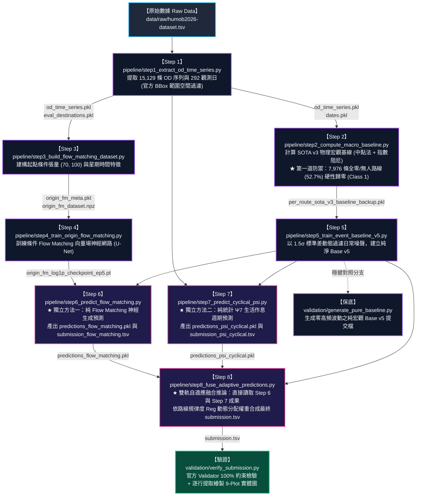

# HuMob 2026 災後人流復甦預測：Flow Matching + Ψ7 自適應共振架構
### 核心端到端獨立預測流程庫（From Raw Data to Final Submission）

本目錄完整封裝從 **官方原始觀測資料（Raw Data）** 到 **最終合格提交檔（`submission.tsv`）** 的全套代碼與執行管線。
現已完整重構為 **獨立神經方法 (Pure FM)** 與 **獨立統計方法 (Pure Ψ7)** 各自產出，最後再進行 **自適應雙軌共振融合** 的清晰解耦架構。

---

## 專案模組化目錄結構 (Repository Architecture)

```text
flow_matching_psi_cyclical_revision/
├── pipeline/                     # ★ 【核心流程】：從 Raw Data 到最終 Submission 的完整管線
│   ├── step1_extract_od_time_series.py          # Step 1: 提取 15,129 條 OD 序列
│   ├── step2_compute_macro_baseline.py          # Step 2: SOTA v3 物理宏觀基線 (Class 1 全零防禦)
│   ├── step3_build_flow_matching_dataset.py     # Step 3: 建構 Flow Matching 空間張量與條件特徵
│   ├── step4_train_origin_flow_matching.py      # Step 4: 訓練條件 U-Net 向量場網路
│   ├── step5_train_event_baseline_v5.py         # Step 5: 1.5σ 去噪訓練事件基線 Base v5
│   ├── step6_predict_flow_matching.py           # Step 6: ★ 獨立純神經 Flow Matching 預測
│   ├── step7_predict_cyclical_psi.py            # Step 7: ★ 獨立純統計 Ψ7 生活作息預測
│   ├── step8_fuse_adaptive_predictions.py       # Step 8: ★ 讀取 Step 6 與 7 成果，雙軌自適應融合推論
│   ├── run_pipeline.py                          # 🚀 一鍵依序執行 Step 1 ~ 8
│   └── src/                                     # ★ 管線運行所必備的 7 大演算法核心模組
│       ├── per_route_sota_v3_baseline.py        # 9 類分層、中點法與指數阻尼橋樑
│       ├── origin_flow_matching.py              # Flow Matching 神經網路與 Euler ODE
│       ├── cyclical_psi.py                      # Ψ7 作息週波分桶與零均值中心化
│       ├── route_features.py                    # 路線規律度 (Reg) 與統計特徵提取
│       ├── residual_fusion.py                   # 雙軌共振融合引擎與三級分層防線
│       ├── japan_calendar.py                    # 日本節假日日曆工具
│       └── baseline_module.py                   # 空間網格基線向量化計算
│
├── validation/                   # ★ 【驗證與評估】：官方規格約束檢查、指標庫與橫向消融比對
│   ├── verify_submission.py                     # 官方約束檢驗 + 逐行提取繪製 9-Plot 實體圖
│   ├── compare_all_submissions.py               # 📊 四大方法提交檔橫向對比審查工具
│   ├── humob2026_validator.py                   # 競賽官方格式驗證器
│   ├── generate_pure_baseline.py                # 生成純平滑基線對照提交檔 (無波動保底)
│   └── evaluation.py                            # MAE, RMSE, Jump Audit 等指標評估工具
│
├── visualization/                # ★ 【視覺化繪圖】：群體多路線分析與門檻特寫
│   ├── plot_threshold_5_benefited_routes.py     # 5.0 人門檻實質受惠之 6 條骨幹路線特寫
│   └── plot_other_class5_class8_routes.py       # Class 5 與 Class 8 群體波動圖譜
│
├── archive_baselines/            # ★ 【歷史存檔】：SOTA v3 誕生前的先導探索基線版本 (v0 ~ v2)
│   ├── per_route_adaptive_baseline.py           # v0 自適應滑動平均原型
│   ├── per_route_exponential_baseline.py        # v1 初版指數阻尼基線
│   ├── per_route_exponential_baseline_v1_sota.py# v1 改進版指數基線
│   ├── per_route_exponential_baseline_v2_stratified.py # v2 初版 9 類分層基線
│   └── README.md                                # 各歷史版本的演進說明
│
├── data/                         # 數據庫
│   ├── raw/                      # 官方原始資料 (humob2026-dataset.tsv)
│   ├── processed/                # 前處理序列與索引
│   └── outputs/                  # 中間特徵、模型權重與四大提交檔
│
├── submission.tsv                # 🏆 最終官方合格提交檔 (FM + Ψ7 雙軌自適應融合最優版)
├── submission_pure_baseline.tsv  # 穩健純基線對照提交檔
└── reports/                      # 視覺化成果圖表存放區
```

---

## 流程總覽圖 (Pipeline Flowchart)



---

## 關鍵物理防禦：全零流量與極低流量分層隔離機制 (Zero & Low-Flow Stratification)

在能登半島震後人流預測中，**盲目將所有路線一視同仁地丟進神經網絡預測是致命的**。本管線設計了三道嚴密的物理與統計隔離防線：

1. **第一道防線：Class 1 全零/無人區硬性隔離 (Hard Zero Defense)**
   - **篩選條件**：歷史最大流量 $< 0.05$ 人，或震前均值與四月容納量雙雙 $< 0.05$ 人。
   - **規模與佔比**：全量 15,129 條評測路線中，高達 **7,976 條（佔比 52.7%！）**。
   - **防禦手段**：在 Step 2 歸入 `Class 1: Persistent Zero`，基線設為 0.0；在 Step 6/7/8 推論時直接 Hard Bypass 強制輸出 `0.0`，完全不經過神經殘差與週波合成，**徹底杜絕在受災荒蕪區產生「鬼影人流」**。
2. **第二道防線：極低流量/高稀疏度基線回退 (Sparsity Safety Fallback)**
   - **篩選條件**：觀測日中零值天數 $n_{\text{zero}} \ge 10$ 天，或全年平均日流量 $\text{mean} \le 2.5$ 人，或規律度極低且均值 $\le 1.2$ 人。
   - **統計原理**：日均 $\le 2.5$ 人的路線本質上是隨機泊松事件，相對噪聲變異係數極高（$CV = 1/\sqrt{\lambda}$）。施加任何波動乘子皆會放大抽樣雜訊。
   - **防禦手段**：直接回退到平滑物理基線（`y_pred = max(0, b_blind)`），關閉神經殘差與週波振幅放大，確保極低流量區絕對平穩。
3. **第三道分層：活躍骨幹路線自適應雙軌共振 (Dual-Boost for Backbone Routes)**
   - **激發條件**：僅針對通過前兩道隔離、且平均日流量 $\text{mean} > 5.0$ 人的 Class 5（全面復甦）與 Class 8（部分消散）骨幹路線，依據作息規律度 $Reg$ 動態分配 $\Psi_7$ 週期波與 Flow Matching 空間擴散增益，精準重建自然起伏。

---

## 快速執行指南 (Quick Start)

### 1. 一鍵執行全套 8 大流程
```bash
python pipeline/run_pipeline.py
```

### 2. 單步逐步執行
```bash
# 前處理與基線
python pipeline/step1_extract_od_time_series.py
python pipeline/step2_compute_macro_baseline.py

# Flow Matching 神經網路訓練
python pipeline/step3_build_flow_matching_dataset.py
python pipeline/step4_train_origin_flow_matching.py
python pipeline/step5_train_event_baseline_v5.py

# ★ 獨立產出兩大方法之預測成果
python pipeline/step6_predict_flow_matching.py     # 輸出 submission_flow_matching.tsv
python pipeline/step7_predict_cyclical_psi.py      # 輸出 submission_psi_cyclical.tsv

# ★ 讀取上述兩大輸出，依規律度自適應合成
python pipeline/step8_fuse_adaptive_predictions.py # 輸出最終 submission.tsv
```

### 3. 官方格式驗證與多方法橫向消融對比
```bash
# 驗證最終預測檔並繪製 9 類驗證圖
python validation/verify_submission.py

# 橫向對比四大方法（純基線 vs 純FM vs 純Ψ7 vs 雙軌融合）之代表路線日跳動
python validation/compare_all_submissions.py
```

---

## 四大版本提交檔成果一覽

| 版本提交檔 | 方法分類 | 核心特點 | 官方驗證狀態 |
| :--- | :--- | :--- | :---: |
| **`submission_pure_baseline.tsv`** | 純宏觀物理基線 | 零高頻波動，完全無相位錯位風險之平滑基線 | `Validation passed!` |
| **`data/outputs/submission_flow_matching.tsv`** | 純神經生成模型 | 僅使用 2D U-Net CNF 空間擴散擾動場 (無統計週波) | `Validation passed!` |
| **`data/outputs/submission_psi_cyclical.tsv`** | 純統計生活作息 | 僅使用 7 日生活作息中位數分桶與零均值中心化 (無神經殘差) | `Validation passed!` |
| **`submission.tsv`** 🏆 | **雙軌自適應共振融合** | **依規律度 Reg 動態融合純 FM 與純 Ψ7，兼具真實作息與微觀起伏** | **`Validation passed!`** |
